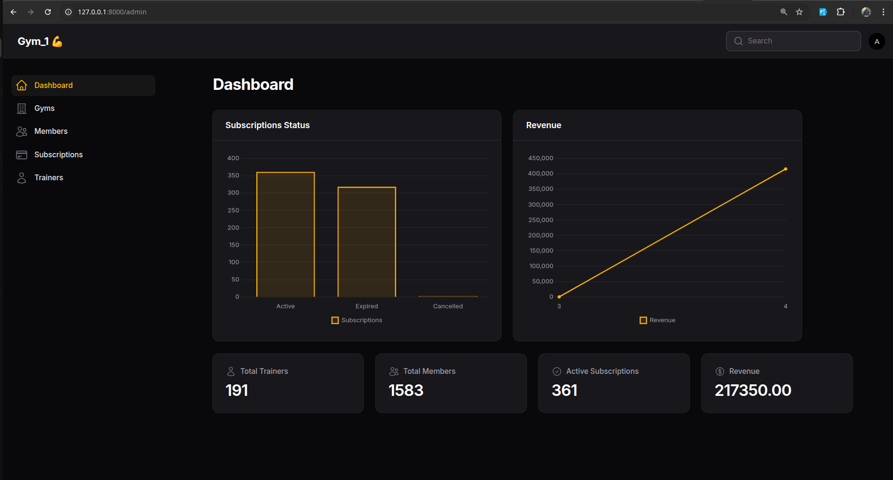

# 🏋️ Gym Management System (SaaS)

A multi-tenant Gym Management System built with **Laravel + Filament**, designed to help gym owners manage members, trainers, and subscriptions efficiently with full data isolation per gym.

---

## 🚀 Features

### 🔐 Authentication System
- Admin login & logout
- Custom authentication flow
- Multi-guard support (admin)
- Route protection using middleware (admin / guest)

### 🏢 Multi-Tenancy
- Each gym acts as a separate tenant
- Full data isolation per gym
- Automatic filtering using global scopes

### 👥 Member Management
- Add / edit / delete members
- Assign trainers to members
- Track member status

### 🧑‍🏫 Trainer Management
- Manage trainers per gym
- Store specialization and salary

### 💳 Subscription System
- Monthly / yearly plans
- Start & end dates
- Status tracking (active, expired, cancelled)

### 📊 Dashboard
- KPIs (members, subscriptions, revenue)
- Charts with tenant isolation

### 🎛️ Admin Panel
- Built with Filament
- Clean UI/UX
- Advanced tables (search, filters)

---

## 🧠 Multi-Tenancy Implementation

This project uses a custom trait to automatically bind data to the logged-in user's gym:

trait BelongsToGym
{
    protected static function booted()
    {
        static::creating(function ($model) {
            if (Auth::check()) {
                $model->gym_id = Auth::user()->gym_id;
            }
        });

        static::addGlobalScope('gym', function (Builder $builder) {
            if (Auth::check()) {
                $builder->where('gym_id', Auth::user()->gym_id);
            }
        });
    }
}

## ✅ Benefits:
Automatic data isolation
No need to manually filter queries
Secure multi-tenant architecture

## 📸 Screenshots

### 📊 Dashboard

